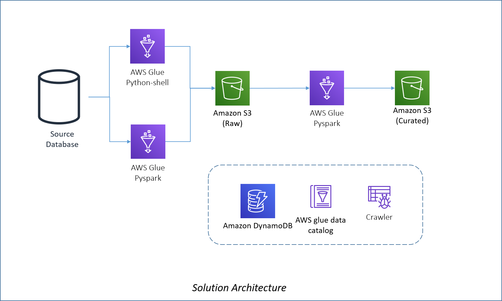

# Integrate data from Relational Databases into Amazon S3 Data Lake
This blueprint contains  components that can be used  to accelerate deployment of data lake solutions on AWS. The blueprint deploys parameterized AWS Glue components that can be used to pull data from relational databases to an Amazon S3 based data lake. 

## How is this blueprint different from the AWS Lake Formation blueprint?
This blueprint is different from the AWS Lake Formation blueprint in the following aspects : 
1. This blupeint gives you the option to leverage either python-shell or pyspark as a source to raw component. The AWS Lake Formation blueprint defaults all components to pyspark. Leveraging a python-shell component helps reduce costs where the amount of data to be processed is not high.
2. This bluprint not only pulls full or incremental data from the source to the raw layer, but also merges your data from the raw to the curated layer. It does so using a number of parameters supplied to the job. The AWS Lake Formation blueprint simply pulls full or incremental data to the raw layer and does not merge data with the curated layer.

## Architecture Overview
The following diagram shows the architecture leveraged by the blueprint.

### Data Extraction Components
The extract components extract data from the source layer and push it to the "Raw" data lake layer in parquet format. There are two variants of the source to raw layer components. You can decide on which component type to use depending on the type of source database, the amount of data to be pulled and the degree of parallelism desired. Choice of the component has significant impact on the cost. So, try to leverage the python-shell component as far as possible.
1. **AWS Glue python-shell component** - This component leverages the [aws-data-wrangler](https://github.com/awslabs/aws-data-wrangler) library to extract data from a relational source database and pushes the data into the raw layer in the data lake. This component can be configured to either do a full extract or an incremental extract. For an incremental extract, the component leverages a [AWS DynamoDB](https://aws.amazon.com/dynamodb/) table which stores the bookmark values. The component is fully paremeterized and takes number of parameters such as AWS Glue connection name, source table and schema names as well as other parameters to control the nature of the pull. This component can be used to create a AWS Glue job to run with either 0.0625 DPUs or 1 DPU depending on the amount of data to be pulled from the source. Definition of DPU is available [here](https://aws.amazon.com/glue/pricing/). The component supports MySQL and PostgreSQL databases as a source.

2. **AWS Glue pyspark component** - This component leverages AWS Glue pyspark to connect to the source database and pushes the data into the raw layer in the data lake.This component can be configured to pull incremental data using [Glue Bookmarks](https://docs.aws.amazon.com/glue/latest/dg/monitor-continuations.html) or do full extracts.For large source tables, it can also be configured to pull data in parallel over JDBC connections.The component is fully paremeterized and takes number of parameters such as  source table and schema names as well as other parameters to control the nature of the pull.This component can be configured to run with a minimum of 2 DPUs. This component should be used when a large amount of data needs to be pulled from the source using multiple partitions in parallel.

### Data Load Component
This component leverages pyspark to merge data extracted from the source in the raw layer into the curated layer in the data lake. This component is parameterized  to handle merges for various scenarios such as mutable and immutable data, partitioned vs unpartitioned storage layer in the curated zone etc.

### DynamoDB Control Table
This table holds the bookmark values that are used to control the incremental  extracts by the python-shell source to raw component. 

## Pre-requisites
Follwoing are the pre-requisites for deploying the blueprint.
1. **VPC** - Identify a VPC which will be used to connect to the source database. The subnets in the VPC need to have outbound connectivity to the internet as well as connectivity to Amazon S3 and DynamoDB over Gateway end-points. The subnets in the VPC should also have private connectivity to the source database.More guidance on this is provided [here](https://docs.aws.amazon.com/glue/latest/dg/start-connecting.html) .

2. **Data Lake S3 Bucket** - Create a S3 bucket to setup the data lake. To improve security of your data lake, you can setup the S3 bucket with appropriate server side encryption. Make sure that the S3 bucket is not publicly accessible.

3. **IAM Roles** - You will need to create an IAM role which would be associated with the deployed Glue jobs and crawlers. This role should have adequate access to all the needed S3 buckets, DynamoDB Table and the AWS Glue catalog as well as Cloudwatch logs. For guidance on how to setup this IAM role, please refer to the AWS Glue documentation [here](https://docs.aws.amazon.com/glue/latest/dg/getting-started-access.html). In addition to this role, you need to create another IAM role that would be used to create a workflow using the blueprint. This role needs to have access to create appropriate S3 buckets, upload objects to S3, create Glue jobs and create DynamoDB tables .   

4. **Glue connection**  - Setup a Glue connection to the source databases.Details on how to setup a Glue connection are available [here](https://docs.aws.amazon.com/glue/latest/dg/console-connections.html).

5. **Glue crawler** -  Setup and run a Glue crawler to crawl the source database using the Glue connection. The crawler will create tables in an appropriate database in the AWS Glue catalog. This step is needed only if you plan to use pyspark to pull data from the source to the raw layer.

6. **Parameter file** - The blueprint deployment needs a parameter file in JSON format to create the jobs. This parameter file has all the details for each table such as whether the pull is full or incremental, whether the data is mutable or immutable etc. to setup appropriate Glue jobs to pull and process the data. For this, create a parameter file in JSON format and upload it to a S3 bucket. More guidance on how to create the parameter file is provided later in this documentation. A sample parameter file has also been provided with the blueprint.

7. **Curated layer Glue catalog Database** - Create a database in the Glue catalog that would be used to store the tables in the curated layer. This corresponds to the curated layer in our database and the definitions of our curated layer tables would be held here. If one is not created before deployment of the blueprint, the same would be created during the blueprint deployment process.

8. **Wheel file for the AWS Data Wrangler python package** - If you want to leverage python-shell jobs for source acquisition, you will need to download the .whl file from [here](https://github.com/awslabs/aws-data-wrangler/releases) and upload it to a S3 bucket.

## Deployment 
To deploy this AWS Glue blueprint, zip the contents of the rel_db_to_s3 folder in this repository into a zip file and upload the zip file to an Amazon S3 bucket. Create an AWS Glue blueprint using the zip file in the S3 bucket. Create a workflow using the blueprint to deploy the AWS Glue jobs needed to hydrate the S3 data lake from your relational data store. Additional help needed to provide parameter values for creation of the workflow using the blueprint as well as creation of the parameter file is provided below.

## Parameters 
This section explains the parameters to be provided to the blueprint as well as the parameters needed in the parameter file

When you use the blueprint to create a workflow, the process will ask for the following parameters

|Parameter|Description|
|:---|:---|
|ParameterFileLocation|Location of the parameter file on S3 in the format s3://bucketname/prefix/filename.json. This parameter is mandatory. Guidance on how to create this parameter file has been provider in a later section in this document. A sample parameter file has also been provided with the blueprint.|
|AWSWranglerWheelFileLocation|Location of the .whl file for the AWS Data Wrangler python package. This is needed only if you intend to use python-shell for any of the source acquisition components. Else, leave it to the default value.|
|WorkflowName|Name of the AWS Glue Workflow to be created. This parameter is mandatory.|
|GlueConnectionName|The name of the AWS Glue connection(mentioned in the pre-requisites above) to be used with the AWS Glue source acquisition jobs. This parameter is mandatory.|
|RawS3Location|S3 location to be used to store the raw layer data in the format s3://bucketname/prefix/. This parameter is mandatory.|
|CuratedS3Location|S3 bucket to be used to store the curated layer data in the format  format s3://bucketname/prefix/. This parameter is mandatory.|
|ValidationResultsS3Location|The S3 location where you want the blueprint deployment process to store the parameter file validation results. Format is in format s3://bucketname/prefix/ If the blueprint deployment fails, please check this location under this bucket to see if there any issues with the parameter file.This parameter is mandatory|
|GlueExecutionRole|IAM role to be associated with the deployed Glue Jobs.This parameter is mandatory.|
|Frequency|Frequency to trigger this ETL workflow automatically.This parameter is optional.|
|FrequencyCronFormat|Custom cron format as 'Custom' frequency setting. (e.g. '* * * * ? *') This config is effective only when 'Frequency' is 'Custom'. If you specify other values in 'Frequency', then this option is ignored.|

The JSON parameter file has a single array element named 'job_parameters'. Each array element then defines various parameters using key value pairs to define various aspects of the job. You need one array element per table that you want to pull from the source. A sample parameter file has been provided with the blueprint for reference. The table below will help you set parameter values in the parameter file.

|Parameter|Description|
|:---|:---|
|source_raw_job_type|This specifies if you want to use python-shell or pyspark for the source acquisition job. Possible values are pyspark or python-shell. This parameter is mandatory.|
|type_of_pull|Specifies whether you want to perform a full or an incremental extract. Possible values are full or incremental. This is a mandatory parameter.|
|source_schema_name|Name of the source schema. This value is also used as a prefix in the raw and curated data layers. This parameter is mandatory.|
|source_table_name|Name of the source table. This value is also used as a prefix in the raw and curated data layers. This parameter is mandatory.|
|nature_of_data|Specifies if the nature of data is mutable or immutable. Possible values are mutable or immutable. The parameter is mandatory.|
|target_db_name|The name of the database in the Glue catalog where the curated data lake tables(S3 based) need to be created. This is the same database that you created as part of the pre-requisites.This is a mandatory parameter.|
|target_partition_columns|Column or columns to be used for partitioning data in the curated zone. If you want to partition the data by more than one column, use a comma separated list of column names. Use value 'None' if the target table is not to be stored as a partitioned table. This parameter is mandatory.|
|compute_capacity_source_raw|Specifies the compute capacity to be used for the source to raw component. If you are using python-shell for source acquisition, specify the number of DPUs(0.0625 or 1). If you are using pyspark for source acquisition specify the number of workers(>2). This is a mandatory parameter.|
|compute_capacity_raw_curated|Number of workers for the raw-curated pyspark job. This value needs to be greater than 2 and is mandatory.|
|raw_curated_worker_type|Glue worker type to be used for the raw to curated pyspark component. Possible values are Standard, G.1X and G.2X.You can get more details on these worker types [here](https://docs.aws.amazon.com/glue/latest/dg/add-job.html). This is a mandatory parameter.|
|bookmark_key|If you wish to pull data incrementally fron the source, this parameter is needed. Specify the column or columns to be used as a bookmark key for incremental pulls. If you want to use a composite key, specify a comma separated list of columns.|
|bookmark_key_order|This parameter is needed if  type_of_pull is incremental and the source to raw component is pyspark.Possible values are 'asc' or 'desc' and is used to determine bookmark column behaviour in the pyspark component.|
|source_db_type|This parameter needs to be set if the source to raw component is python-shell. Possibe values are 'mysql' and 'postgres'|
|parallel_pull|This parameter needs to be set if the source to raw component is pyspark. Possible values are true and false. Set this value to true if you want to pull a large table in parellel as explained [here](https://docs.aws.amazon.com/glue/latest/dg/run-jdbc-parallel-read-job.html).|
|hashfield|Specify the field to be used to logically partition your data to enable parallel reads from the source. This parameter is needed only when parallel_pull is set to true.|
|hashpartitions|The numer of logical partitions to be used to pull data using parallel reads.This parameter is needed only when parallel_pull is set to true. Exercise caution when setting this value as it may generate a large number of queries on the source table.|
|glue_catalog_db_name|This parameter is needed if the source to raw component is pyspark. Specify the name of the Glue catalog database which has metadata about the source database tables(that was populated using the crawler as part of the pre-requisites).|
|glue_catalog_table_name|This parameter is needed if the source to raw component is pyspark. Specify the name of the Glue catalog table(name as in the Glue catalog DB) pointing to the table to be sourced.|
|primary_key|Primary key column or columns to be used to merge the data in the raw layer into the curated layer. If the table has a composite primary key, provide comma separated column names. This parameter is needed only for incremental data loads where nature_of_data is mutable.|
|source_raw_worker_type|Glue worker type to be used for the source to raw component. Possible values are Standard, G.1X and G.2X.You can get more details on these worker types [here](https://docs.aws.amazon.com/glue/latest/dg/add-job.html). This parameter is needed only is the source to raw component is pyspark|
